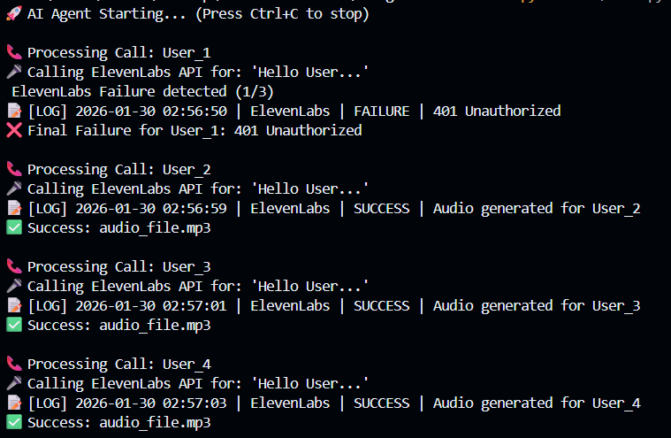
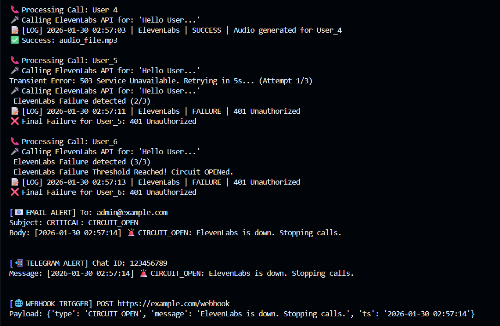
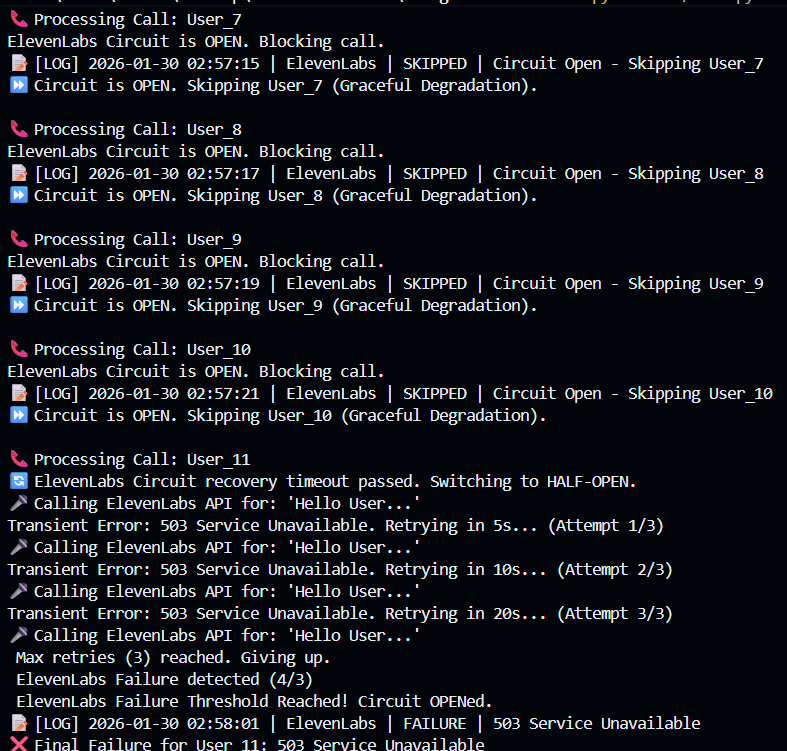
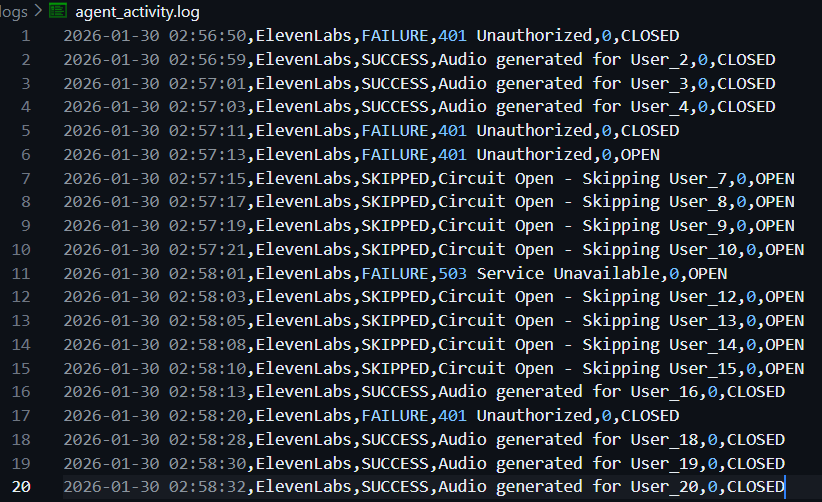
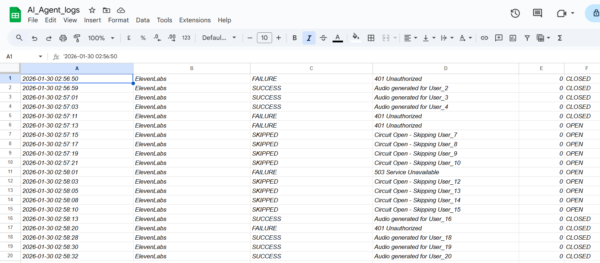

# 🛡️ AI Agent Resilience System (Incubation Day 2)

## 📌 Project Overview
This project implements a robust **Fault-Tolerance Wrapper** for an AI Voice Agent. It is designed to handle the unreliability of third-party APIs (like ElevenLabs or LLMs) by implementing industry-standard resilience patterns.

Instead of allowing API failures to crash the agent, this system categorizes errors, retries transient failures intelligently, and uses a **Circuit Breaker** to prevent cascading system overload.

---

## 🏗️ Architecture & Design Decisions

The system is built on a modular "Separation of Concerns" architecture:

* **The Guard (`exceptions.py`):** A custom exception hierarchy that strictly differentiates between:
    * **Transient Errors (503):** Temporary glitches where a retry is safe and useful.
    * **Permanent Errors (401/400):** Fatal errors where retrying is futile.
* **The Brain (`resilience.py`):** Contains the core logic for the **Retry Mechanism** (Exponential Backoff) and the **Circuit Breaker** state machine.
* **The Scribe (`logger.py`):** Ensures observability by logging every event to both a local CSV file and **Google Sheets**.
* **The Messenger (`alert.py`):** A notification system that triggers alerts (Mock Email/Telegram) only when critical thresholds are breached.

---

## ⚙️ Error Flow & Resilience Logic

The agent processes calls through the following logic flow:

### 1. Error Categorization
Every API exception is caught and analyzed:
* **If Transient (e.g., 503 Service Unavailable):** The system initiates the Retry Loop.
* **If Permanent (e.g., 401 Unauthorized):** The system fails fast, logs the error, and moves to the next user.

### 2. Smart Retry (Exponential Backoff)
* **Initial Delay:** 5 seconds (as per requirements).
* **Backoff Factor:** 2x (5s → 10s → 20s).
* **Max Retries:** 3 attempts.
* *Why?* This prevents spamming a struggling server and gives it time to recover.

### 3. Circuit Breaker Pattern
To prevent cascading failures, the Circuit Breaker monitors the health of the service:
* **CLOSED (Green):** Normal operation. Calls go through.
* **OPEN (Red):** Triggered after **3 consecutive failures**. All future calls are immediately blocked (Graceful Degradation) to save resources.
* **HALF-OPEN (Yellow):** After a cooldown (10s), one test request is allowed through. If successful, the circuit resets to CLOSED.

---

## 🚨 Alerting Logic

Alerts are not sent for every minor error. To reduce noise, the system uses **Threshold-Based Alerting**:

* **Trigger Condition:** The alert fires **only** when the Circuit Breaker transitions to the `OPEN` state.
* **Channels:**
    * 📧 **Email:** Sent to Admin.
    * 📲 **Telegram:** Sent to Operations Channel.
    * 🌐 **Webhook:** POST request to monitoring dashboard.

---

## 📂 Project Structure

```text
ai-agent-resilience/
├── src/
│   ├── main.py         # Entry point (Business Logic)
│   ├── resilience.py   # Retry & Circuit Breaker Logic
│   ├── services.py     # Mock Service (Simulates 503/401 errors)
│   ├── logger.py       # Google Sheets & File Logging
│   ├── exceptions.py   # Custom Error Classes
├── alert.py        # Notification System
├── logs/
│   └── agent_activity.log
├── config.py           # Configuration (Thresholds, API Keys)
├── requirements.txt    # Dependencies
└── README.md           # Documentation

## 📊 Evidence & Logs

### 1. Circuit Breaker & Alerts (Terminal)
*The system detects repeated failures, trips the circuit, triggers alerts, and recovers automatically.*

| Phase 1: Retry Logic | Phase 2: Alerts Triggered | Phase 3: Recovery |
| :---: | :---: | :---: |
|  |  |  |

### 2. Persistent Logging
*Audit trails are maintained in both local files and Google Sheets.*

| **Local File Logs (`agent_activity.log`)** | **Google Sheets Real-Time Dashboard** |
| :---: | :---: |
|  |  |